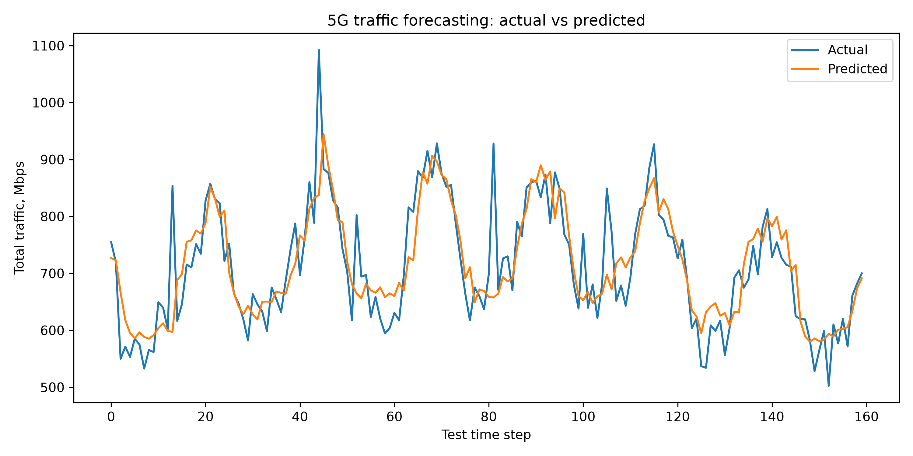
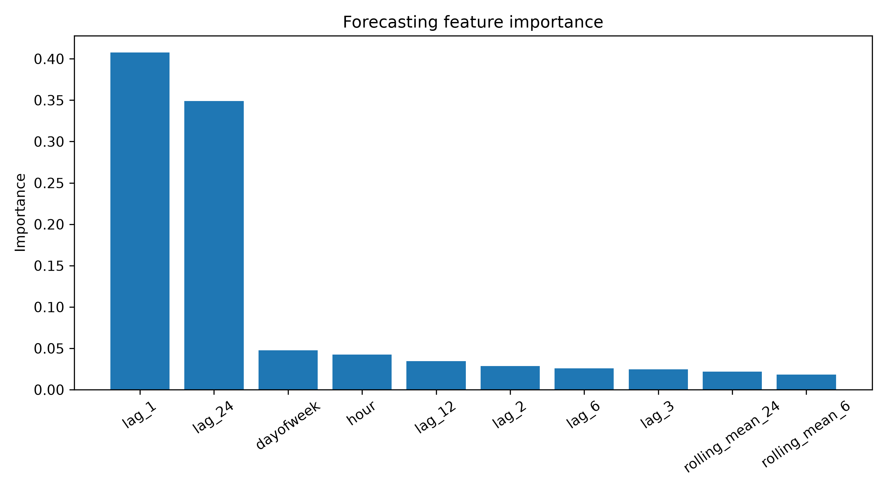

# 5G Traffic Forecasting

A Data Science project for forecasting synthetic 5G traffic load across **eMBB**, **URLLC** and **mMTC** services.

This repository is designed for a GitHub portfolio: it shows time-series feature engineering, machine learning regression, evaluation against a naive baseline, visualizations, tests, Docker and CI.

## Problem

Network slicing becomes more efficient when the operator can estimate future demand. A simple forecasting model can help decide when to increase or decrease resources for a slice.

## What is implemented

- Synthetic hourly 5G traffic generator.
- Service-level traffic columns: `embb_mbps`, `urllc_mbps`, `mmtc_mbps`.
- Total network demand forecasting.
- Lag features: 1, 2, 3, 6, 12 and 24 hours.
- Rolling averages over 6 and 24 hours.
- Random Forest regression model.
- Comparison against a naive `lag_1` baseline.
- Forecast plots and feature importance.

## Project structure

```text
5g-traffic-forecasting/
├── src/traffic_forecasting/
│   ├── data.py          # synthetic traffic generation
│   ├── features.py      # lag and rolling features
│   ├── model.py         # training and evaluation
│   └── experiment.py    # full reproducible experiment
├── scripts/run_experiment.py
├── tests/
├── requirements.txt
└── Dockerfile
```

## Quick start

```bash
python -m venv .venv
source .venv/bin/activate  # Windows: .venv\Scripts\activate
pip install -r requirements.txt
pip install -e .
python scripts/run_experiment.py
```

The results are saved in `results/`:

```text
synthetic_5g_traffic.csv
forecast_metrics.csv
forecast_predictions.csv
forecast_actual_vs_predicted.png
feature_importance.csv
feature_importance.png
```

## Docker

```bash
docker build -t 5g-traffic-forecasting .
docker run --rm 5g-traffic-forecasting
```

## Portfolio summary

This project demonstrates time-series forecasting, feature engineering, machine learning evaluation, telecom domain understanding and reproducible research code.

## Future improvements

- Add ARIMA/SARIMA baseline.
- Add LSTM/GRU neural forecasting model.
- Forecast each slice separately.
- Connect the forecast output to the `qoe-greenslicer-rl` resource controller.

## Results preview

This experiment forecasts synthetic 5G traffic using time-series lag features, rolling statistics and a Random Forest regression model.

### Forecasting metrics

| Metric | Value |
|---|---:|
| MAE | 41.42 |
| RMSE | 57.57 |
| R² | 0.692 |
| Baseline MAE | 55.67 |

The model reduces MAE by approximately **25.6%** compared with the naive baseline.

### Actual vs predicted traffic



### Feature importance



